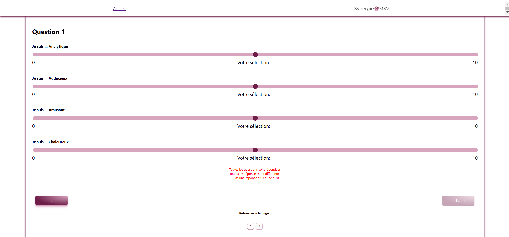

# Plateforme SynergieMSV

Une plateforme web conçue pour gérer efficacement les clients et les équipes des clients de Synergia. Personnalisé selon les demandes de la propriétaire. La plateforme permet la création de "profils" de personnalité grâce à l'intelligence artificiel pour ceux ayant rempli un questionnaires au préalable. 

---

## Table des matières

- [Aperçu](#aperçu)
- [Fonctionnalités](#fonctionnalités)
- [Technologies utilisées](#technologies-utilisées)
- [Deploiement](#Deploiement)
- [Licence](#licence)

---

## Aperçu

Cette plateforme a été développée pour centraliser la gestion des clients, générer des rapports, et optimiser les interactions entre les équipes. Elle inclut une interface conviviale permettant d'ajouter, de modifier, de visualiser les informations des clients et de générer des documents personnalisés à l'aide d'OpenAI. Ce texte sera également transposé dans un modèle Canva pour faciliter la finition. Pour l'instant seul la portion pour le rôle "admin" est disponible. 

## Fonctionnalités

- **Création d'utilisateur de plateforme** : Plateforme permettant de créer un mot de passe avec des sessions protégées et usage différent selon le type d'utilisateur.
- **Création de "Profils** : Création d'un texte automatisé, c'est également par cette fonction que le client ainsi que les leaders d'équipe seront enregistré dans la base de données.
- **Gestion des équipes** : Organisation des équipes liées aux leaders.
- **Téléversement et téléchargement de fichiers** : Gestion des documents pour chaque leader d'équipe.
- **Feuille de route** : liste de Todo pour avoir un meilleur suivi du progrès pour chaque client.
- **Navigation intuitive** : Interface claire et responsive.

## Technologies utilisées

- **Frontend** :
  - React
  - Redux
  - CSS (Grid, Flexbox)
  - HTML
  

- **Backend** :
  - Node.js
  - Express
  - Redis
  - Passport
  - Multer pour la gestion des fichiers

- **Base de données** :
  - PostgreSQL
  - BD Render

- **API** :
  - OpenAI (GPT-4)
  - Canva
  - AWS S3

## Description des pages

# Accueil de l'admin
Affichage de chaque client avec des informations pertinentes à la gestionnaire. La portion générateur de texte permet de se connecter à des api canva. En écrivant le nom de la personne ayant remplie le formulaire, un document complet se génerera sur Canva qui sera complété par des textes crées grace à des API OpenAi en fonction des réponses du questionnaire.

# Objectifs des clients
Page pour mettre en place des objectifs lors d'une rencontre avec le client. Le client reçois les informations sur son côté de la plateforme

# Feuille de route des clients
Page de "Todos" pour chaque client. Également possible d'ajouter ou retirer des tâche pour les clients de façon individuel ou bien à tous à la fois.

# Information Client
Page d'information incluant tout ce que la gestionnaire a besoin incluant le profil de personnalité complet. Comprend également un système de fichiers hébergé par AWS S3.

# Accueil Client (non-terminé)
Page d'accueil du côté client de la plateforme. Pour l'instant, peu de travaille a été fait sur le design, mais le client aura de l'information rapide en lien avec ses résultats, ainsi que ceux de son équipe.

# Formulaire (en cours)
Présentement le formulaire se fait via un site externe qui envoie les données en Excel. Cette page prendra la place prochainement afin que tout reste sur le même site et que les datas aillent directement dans la base de données. 

## Deploiement

Le site est déployé sur render, bien que pas encore fonctionnel à 100%.
(https://projet-synergiemsv.onrender.com/login)

## Amélioration à venir

- **Terminer la migration du formulaire externe vers celui du site**
- **Créer un onglet "Gestion" permettant d'attribuer des clients par groupe. Permettra également de générer des url de questionnaire pré-rempli en fonction du groupe auquel le client fera parti.**
- **Ajout des pages et fonctionnalités pour les rôles "leader" et "user"**
- **Ajout de fonction de recherche**
- **Ajout de la fonction "récupération de mot de passe**
- **Dans la fonction génération de texte, aller chercher directement les options disponibles. À la place de devoir connaître exactement le nom bien écrit**
- **Donner plus de flexibilité dans la création de client et leader**

## Licence

This project is proprietary and not open-source. All rights reserved.
